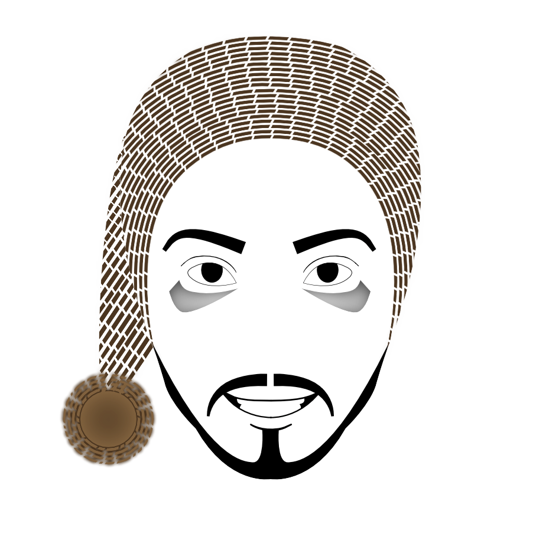

<h1>Hola 👋, Soy Cesar!!! </h1>

<h2>Soy Desarrollador Web Full-Stack y algunas veces Desarrollador de IA</h2>
<p align="justify">Durante toda mi
carrera universitaria he desarrollado
proyectos relacionados a Inteligencia
Artificial y Desarrollo Web tanto backend
como frontend, una de las cosas más
interesantes que he experimentado es
poder solucionar problemas del mundo
real a través de la construcción de
aplicaciones que no solamente depende
de una tecnología sino que también lo
puedes integrar con otras muchas
tecnologías, y lo más retador que pude
experimentar es la capacidad de escalar
tu aplicación utilizando patrones de
arquitectura y principios de desarrollo</p>

<h3 align="left">Conéctate conmigo:</h3>
<p align="left">
  <a href="https://twitter.com/vqc1909a" target="blank"></a>
  <a href="https://linkedin.com/in/victor-cesar-quispe-atencio" target="blank"></a>
  <a href="https://www.youtube.com/channel/UCRmvoSvGgaDw7RUFwRNVsbQ" target="blank"></a>
</p>

<h3 align="left">Lenguajes y Herramientas:</h3>
<p align="left">
  <a href="https://getbootstrap.com" target="_blank">  </a>
  <a href="https://bulma.io/" target="_blank">  </a>
  <a href="https://expressjs.com" target="_blank">  </a>
  <a href="https://www.figma.com/" target="_blank">  </a>
  <a href="https://git-scm.com/" target="_blank">  </a>
  <a href="https://gulpjs.com" target="_blank">  </a>
  <a href="https://heroku.com" target="_blank">  </a>
  <a href="https://developer.mozilla.org/en-US/docs/Web/JavaScript" target="_blank">  </a>
  <a href="https://jestjs.io" target="_blank">  </a>
  <a href="https://www.mongodb.com/" target="_blank">  </a>
  <a href="https://www.mysql.com/" target="_blank">  </a>
  <a href="https://nodejs.org" target="_blank">  </a>
  <a href="https://www.python.org" target="_blank">  </a>
  <a href="https://reactjs.org/" target="_blank">  </a>
  <a href="https://redis.io" target="_blank">  </a>
  <a href="https://redux.js.org" target="_blank">  </a>
  <a href="https://sass-lang.com" target="_blank">  </a>
  <a href="https://www.sqlite.org/" target="_blank">  </a>
  <a href="https://www.tensorflow.org" target="_blank">  </a> 
</p>


###  Más sobre mi... 
```javascript
const vqc1909a = {
  languajes: [Javascript, Python, SQL],
  askMeAbout: ["app dev", "web dev", "ai dev"],
  technologies:{
      backEnd: ["Nodejs", "Express", "Python"],
      fronEnd: ["React", "Redux", "Styled-Components", "GSAP", "SASS"],
      testing: ["Jest", "Enzyme", "Cypress"]
      database: ["Mongo","Mysql", "Redis", "SQLite],
      devOps: ["Nginx"],
  },
  architecture: ["Monolithic Architecture", "microservices", "Layer-based architecture"]
}
```
###  Últimos videos en mi [canal de Youtube](https://www.youtube.com/channel/UCRmvoSvGgaDw7RUFwRNVsbQ):
<a href='https://www.youtube.com/watch?v=_hEst_un5tM' target='_blank'>
   
 </a><a href='https://www.youtube.com/watch?v=5azYQzB2dFU' target='_blank'>
   
 </a><a href='https://www.youtube.com/watch?v=XeAfkhQOBUA' target='_blank'>
   
 </a>

###  Estadísticas:
<p></p>
<p>&nbsp;</p>


